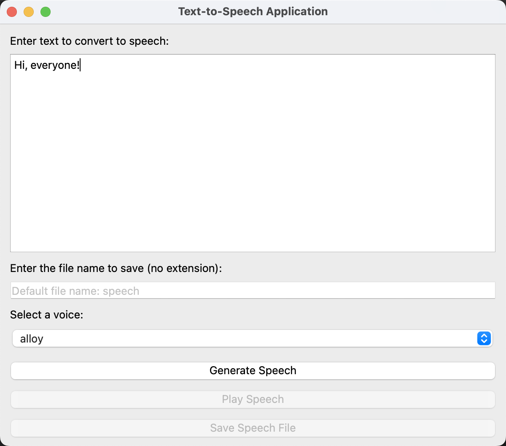

# Text-to-Speech Application

A simple GUI-based application for converting text to speech using the OpenAI API and PySide6. This application allows users to input text, select a voice tone, and save the generated audio file. The audio files are organized into a designated folder for better management.

Chinese README [here.](./README_zh.md)

---

## Features

- **Text Input**: Users can input the text to be converted into speech.
- **Voice Selection**: Choose from a variety of voice tones, including `alloy`, `ash`, `coral`, `echo`, `fable`, `onyx`, `nova`, `sage`, and `shimmer`. The default voice is `alloy`.
- **File Naming**: Users can specify a file name for the saved audio. If no name is provided, the default name `speech` will be used.
- **Audio Playback**: Play the generated audio directly within the application.
- **File Organization**: All generated audio files are saved in the `audio_files` folder within the project directory.
- **File Export**: Save the generated audio file to a custom location.

---

## Prerequisites

1. Python 3.8 or higher.
2. An OpenAI API key. Set it as an environment variable:
   ```bash
   export OPENAI_API_KEY="your_openai_api_key"
   ```

---

## Installation

1. Clone this repository:
   ```bash
   git clone https://github.com/xingkongliang/text-to-speech-app.git
   cd text-to-speech-app
   ```

2. Install the required dependencies:
   ```bash
   pip install -r requirements.txt
   ```

3. Set the `OPENAI_API_KEY` environment variable:
   ```bash
   export OPENAI_API_KEY="your_openai_api_key"
   ```

---

## Usage

1. Run the application:
   ```bash
   python tts_app.py
   ```

2. **How to Use**:
   - Input the text you want to convert to speech.
   - Optionally, enter a file name for the output audio file.
   - Select a voice tone from the dropdown menu.
   - Click `Generate Speech` to create the audio file.
   - Use the `Play Speech` button to play the generated audio.
   - Save the audio file to a custom location using the `Save Speech File` button.

---

## File Organization

- **audio_files/**: All generated audio files are saved here.
  - If the folder does not exist, the application will create it automatically.

---

## Dependencies

This project uses the following libraries:

- [PySide6](https://pypi.org/project/PySide6/)
- [OpenAI](https://pypi.org/project/openai/)

Install all dependencies using:
```bash
pip install -r requirements.txt
```

---

## Customization

- **Voice Tones**: Modify the list of available voices in the `self.voice_selector.addItems([...])` section of the code.
- **Default File Name**: Change the placeholder for the file name input in the `file_input.setPlaceholderText("默认文件名：speech")`.

---

## Screenshots



---

## License

This project is licensed under the MIT License. 

---

## Contributing

Contributions are welcome! Feel free to fork the repository, create a new branch, and submit a pull request.

---

