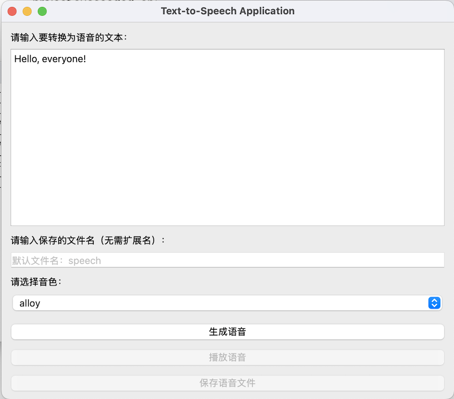

# 文本转语音应用程序

这是一个基于 GUI 的简单应用程序，使用 OpenAI API 和 PySide6 将文本转换为语音。用户可以输入文本，选择音色，并将生成的音频文件保存到指定位置。所有音频文件会自动保存在一个专门的文件夹中，便于管理。

---

## 功能

- **文本输入**：用户可以输入需要转换为语音的文本。
- **音色选择**：从多种音色中选择，包括 `alloy`、`ash`、`coral`、`echo`、`fable`、`onyx`、`nova`、`sage` 和 `shimmer`，默认音色为 `alloy`。
- **文件命名**：用户可以为生成的音频文件指定名称。如果未输入名称，则使用默认名称 `speech`。
- **音频播放**：可以直接在应用程序中播放生成的音频文件。
- **文件组织**：所有生成的音频文件会保存在项目目录下的 `audio_files` 文件夹中。
- **文件导出**：可以将生成的音频文件保存到自定义位置。

---

## 前置条件

1. 安装 Python 3.8 或更高版本。
2. 获取 OpenAI API 密钥，并设置为环境变量：
   ```bash
   export OPENAI_API_KEY="your_openai_api_key"
   ```

---

## 安装

1. 克隆此代码仓库：
   ```bash
   git clone https://github.com/xingkongliang/text-to-speech-app.git
   cd text-to-speech-app
   ```

2. 安装所需依赖：
   ```bash
   pip install -r requirements.txt
   ```

3. 设置 `OPENAI_API_KEY` 环境变量：
   ```bash
   export OPENAI_API_KEY="your_openai_api_key"
   ```

---

## 使用方法

1. 启动应用程序：
   ```bash
   python tts_app_zh.py
   ```

2. **操作步骤**：
   - 在文本框中输入要转换为语音的内容。
   - （可选）输入生成音频文件的名称。
   - 在下拉菜单中选择音色。
   - 点击 **生成语音** 按钮生成音频文件。
   - 使用 **播放语音** 按钮播放生成的音频文件。
   - 使用 **保存语音文件** 按钮将音频文件保存到其他位置。

---

## 文件组织

- **audio_files/**：所有生成的音频文件都保存在此文件夹中。
  - 如果文件夹不存在，应用程序会自动创建。

---

## 依赖

此项目依赖以下库：

- [PySide6](https://pypi.org/project/PySide6/)
- [OpenAI](https://pypi.org/project/openai/)

通过以下命令安装所有依赖：
```bash
pip install -r requirements.txt
```

---

## 自定义

- **音色**：可以在代码中 `self.voice_selector.addItems([...])` 部分修改支持的音色列表。
- **默认文件名**：可以在 `file_input.setPlaceholderText("默认文件名：speech")` 中更改默认文件名提示。

---

## 截图



---

## 许可证

此项目采用 MIT 许可证。详细信息请参阅 [LICENSE](LICENSE) 文件。

---

## 贡献

欢迎贡献！您可以 fork 此仓库，创建新分支并提交 Pull Request。


